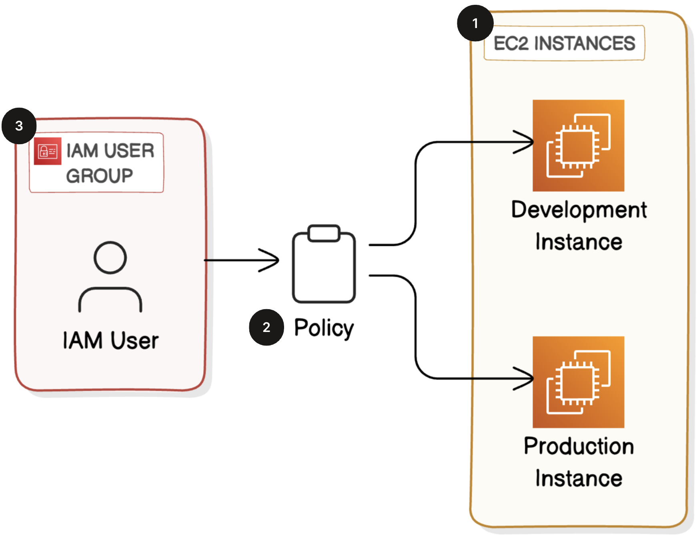

# AWS IAM Cloud Security

This project demonstrates how to secure an AWS environment using **Identity and Access Management (IAM)**.  
It focuses on applying least privilege, separating identities, and protecting access to AWS resources.

---

## Workflow Diagram

---

## What This Project Covers

- IAM users vs IAM roles  
- Least‑privilege policy design  
- Temporary credentials (STS)  
- MFA and password policies  
- Access control for EC2 and S3  
- Basic monitoring with CloudTrail and IAM Access Analyzer  

---

## Tools Used

- AWS IAM
- AWS STS
- EC2 (role-based access)
- S3 (restricted access)
- CloudTrail
- IAM Access Analyzer

---

## How It Works

-IAM users and roles are created with least-privilege policies.  
-MFA and password policies enforce secure authentication.  
-CloudTrail and IAM Access Analyzer provide monitoring and visibility.

---
